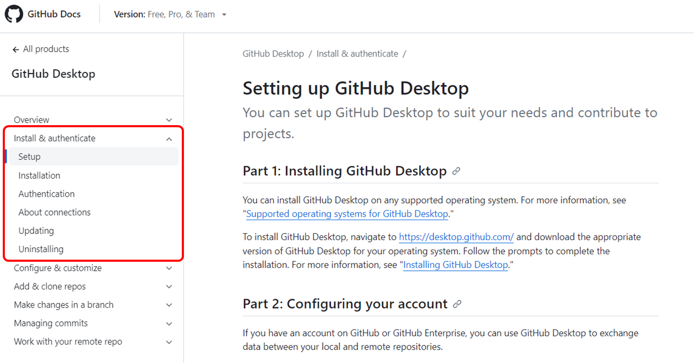
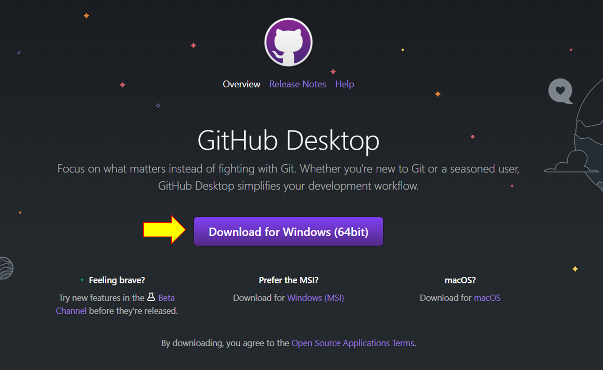
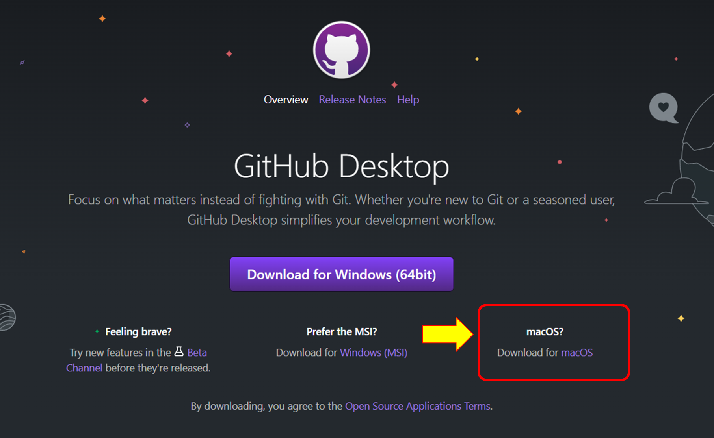

# การทดลอง
## 1. ติดตั้งโปรแกรม github desktop
1.1 Browse ไปที่หน้า document ของ [github desktop](https://docs.github.com/desktop) อ่านและทำความเข้าใจเอกสาร

1.2  ดำเนินการตาม document ในหัวข้อ Install & authentication
 

 เมื่อคลิกลิ้งค์จะ redirect มายังหน้า download ซึ่งโดยเริ่มต้นจะให้ download สำหรับผู้ใช้ Windows

 

สำหรับผู้ที่ใช้ macOS สามารถรับโปรแกรมได้ที่ลิ้งค์ดังรูป

ซึ่งจะได้ไฟล์มาในนามสกุล .zip สามารถนำไปติดตั้งใช้งานบนเครื่อง macOS ได้

ผู้ใช้ Linux ubuntu สามารถดำเนินการติดตั้งได้ตามแนวทางในลิงค์ด้านล่างนี้

https://gist.github.com/berkorbay/6feda478a00b0432d13f1fc0a50467f1

หรือ

https://github.com/kontr0x/github-desktop-install

1.3 Authen กับ website github เพื่ออนุญาตให้ github desktop สามารถใช้งาน account ของเราได้

# [>> การใช้งาน github desktop>>](W12-Labsheet-01.md)