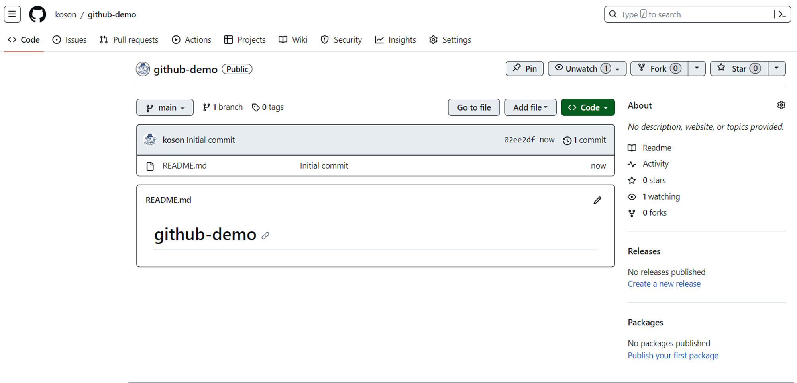
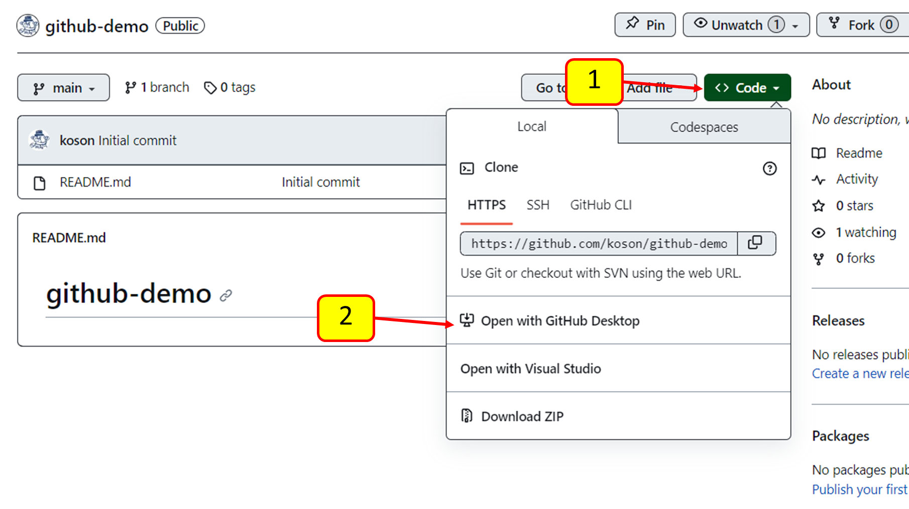
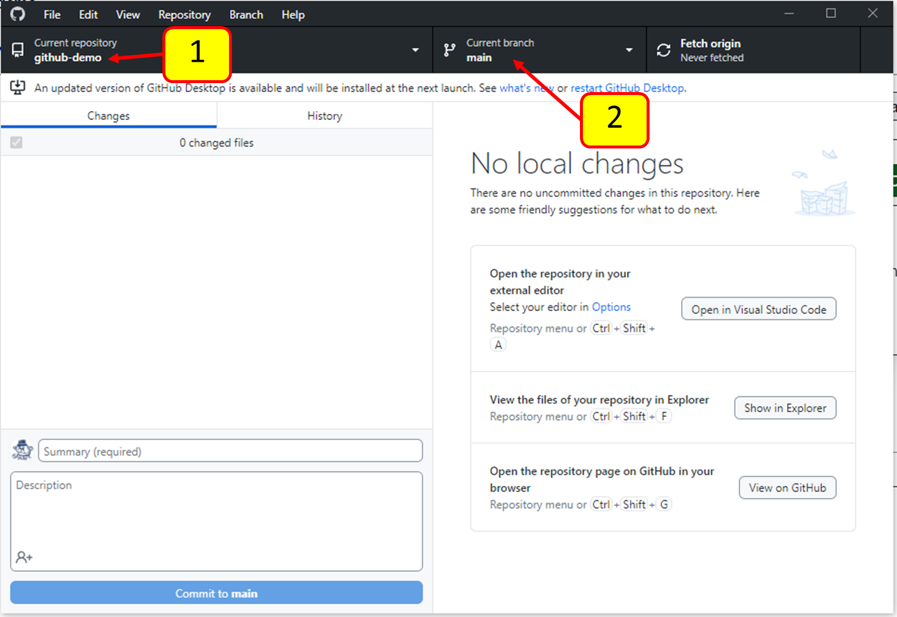
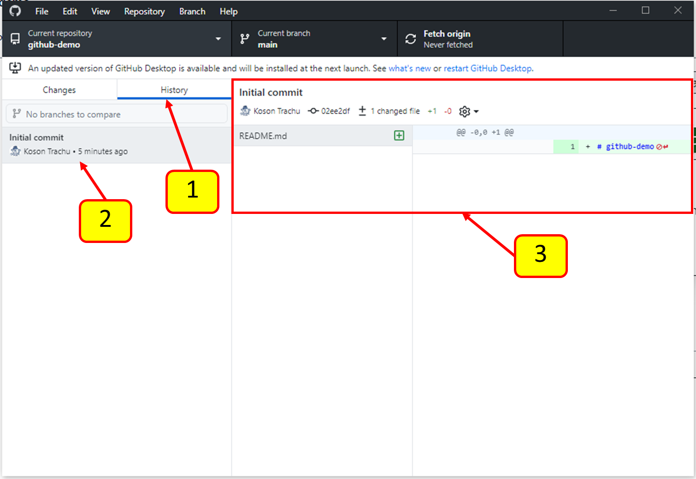
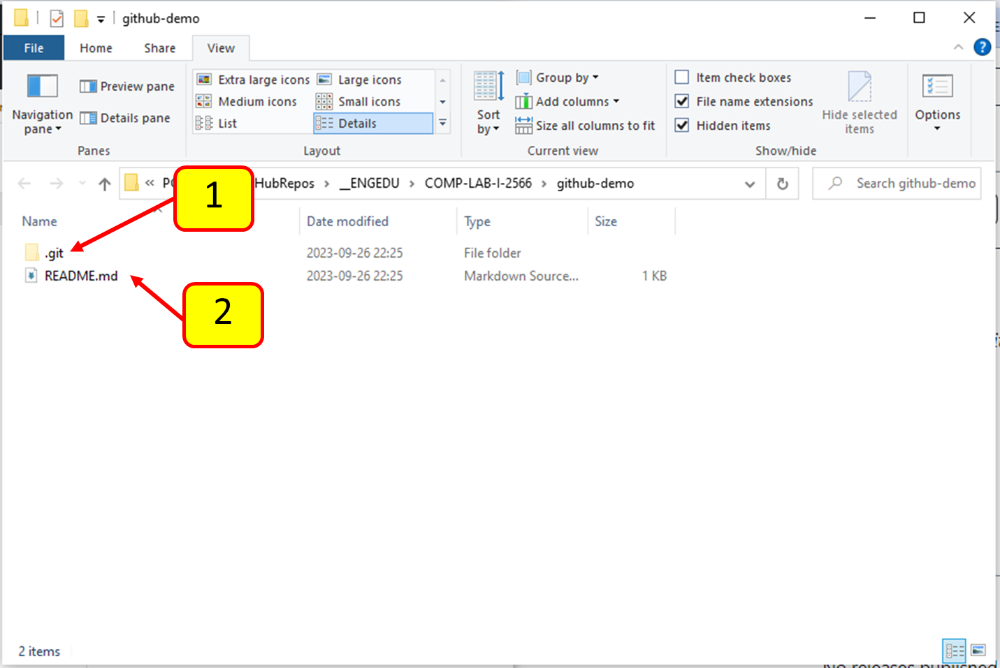
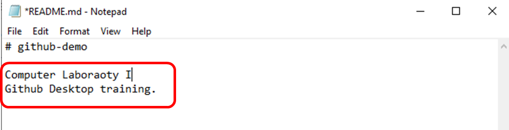
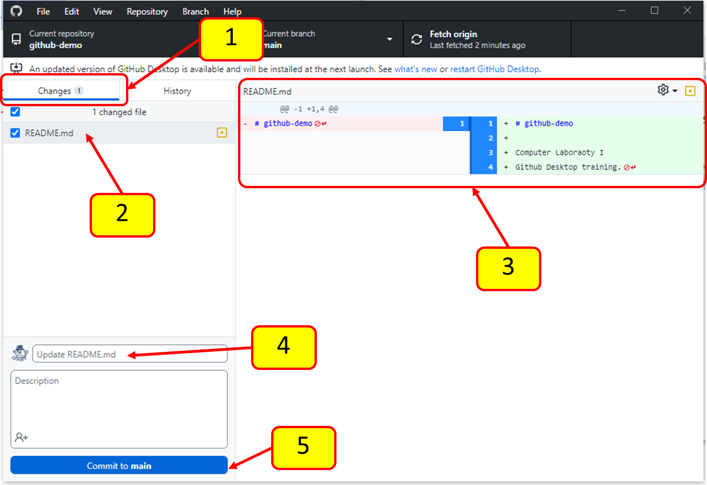

# การทดลอง

## 2. การใช้งานโปรแกรม github desktop ทำงานพื้นฐาน

### 2.1 การ clone repository จาก github 

#### 1. ใช้ web browser เปิด repository ใดก็ได้ บน github.com โดยในลำดับแรกนี้ควรต้องเป็น repository ใน account  ของตนเอง

#### 2. Clone จาก remote (origin) บน github.com มายัง local repository

(1) คลิกที่ปุ่ม code (สีเขียว)

(2) คลิกที่  Open with Github Desktop

#### 3. ระบบจะพามาที่โปรแกรม github desktop เพื่อเลือกที่ตั้งของ Local repository

เลือกวิธีการ clone จาก URL

(1) ใช้ url ตามที่โปรแกรมใส่ให้โดยอัตโนมัติ (มาจาก github.com)

(2) เลือกที่ตั้งบน harddisk โดยต้องไม่มีชื่อ  path เป็นอักขระต้องห้าม

ควรมีเฉพาะอักษรภาษาอังกฤษและไม่มีช่องว่างใน path

(3) กด clone

#### 4. ตรวจสอบผลการ clone

(1) ชื่อของ repository ต้องตรงกับบน remote repository บน github.com

(2) Branch ปัจจุบันคือ main

สังเกตว่าหน้าต่างด้านขวาของ github desktop  จะรายงานว่าปัจจุบันยังไม่มีการเปลี่ยนแปลงใดๆ ของเนื้อหาใน  ไนพารืเ directory 

#### 5. ตรวจสอบประวัติการ commit

(1) คลิกที่ history

(2) ตรวจสอบประวัติการ commit

(3) เปรียบเทียบรุ่นเก่าและใหม่ของไฟล์ที่ถูกแก้

- Initial commit คือชื่อของ commit แรกของ repository ที่ถูกสร้างโดย github.com

- ในตัวอย่างนี้มีเพียงไฟล์ README.md ถ้ามีหลายไฟล์ ให้เลือกจากรายการไฟล์ใน pane ด้านซ้ายของห

#### 6. ทดลองแก้ไขไฟล์ใน working directory

คลิกเมนู Repositpry -> Show in Explorer ดังภาพต่อไปนี้

#### 7. Github desktop จะเปิด folder ของ  working directory ขึั้นมาใน file explorer

(1) .git คือที่อยู่ของ local repository ห้ามแก้ไขหรือลบ folder นี้ มิฉะนั้นอาจจะไม่สามารถรักษาประวัติการแก้ไขไฟล์ได้

(2) ให้เปืดไฟล์ README.md ด้วย text editor (ในตัวอย่างใช้โปรแกรม notepad.exe ซึ่งมีมากับ Windows ทุกรุ่น)

#### 8. เพิ่มเติมเนื้อหาของไฟล์ใน README.md

ใส่ข้อความจำนวน 2 บรรทัด ลงใน README.md

บันทึกไฟล์ README.md

#### 9. กลับไปที่โปนแกรม github desktop เพื่อตรวจสอบการเปลี่ยนแปลงที่เกิดขึ้น 

## [>> การใช้งาน github desktop>>](W12-Labsheet-01.md)
