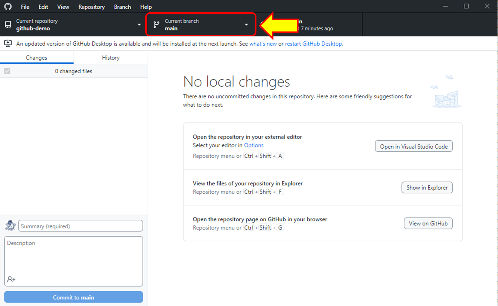
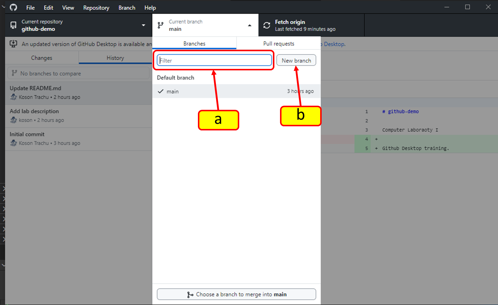
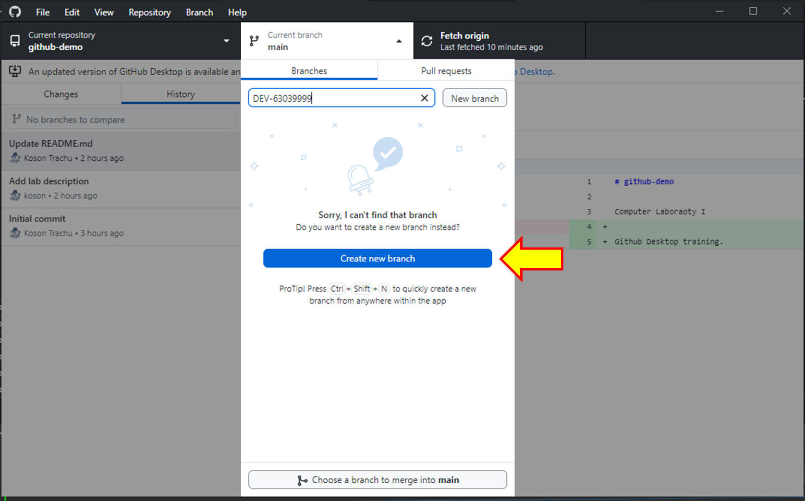
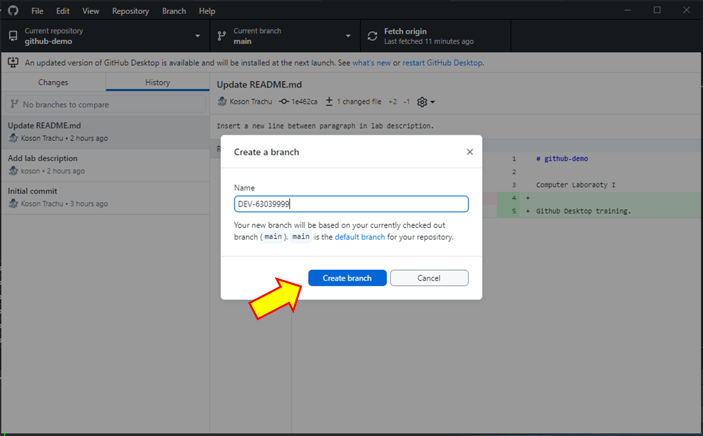
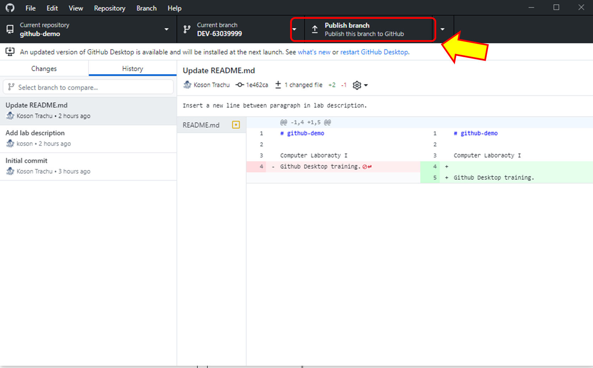
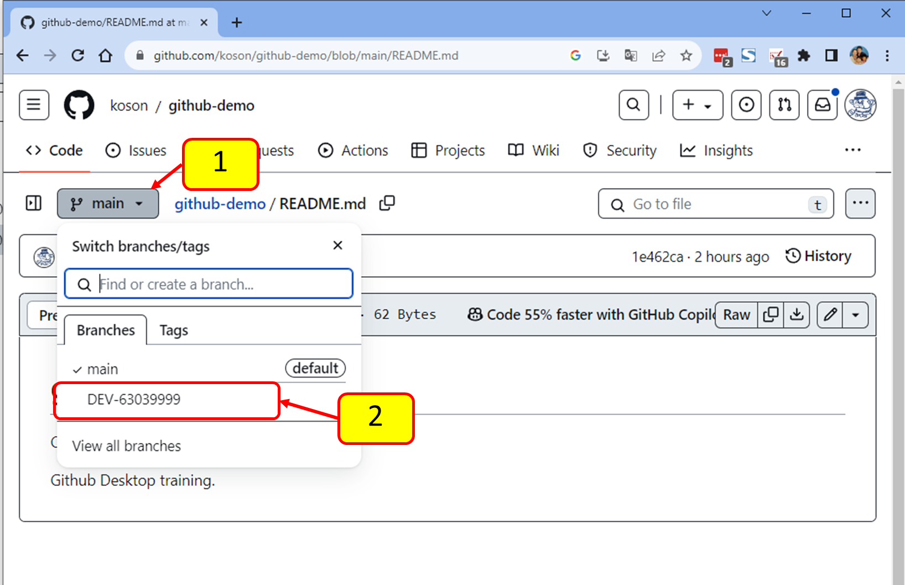
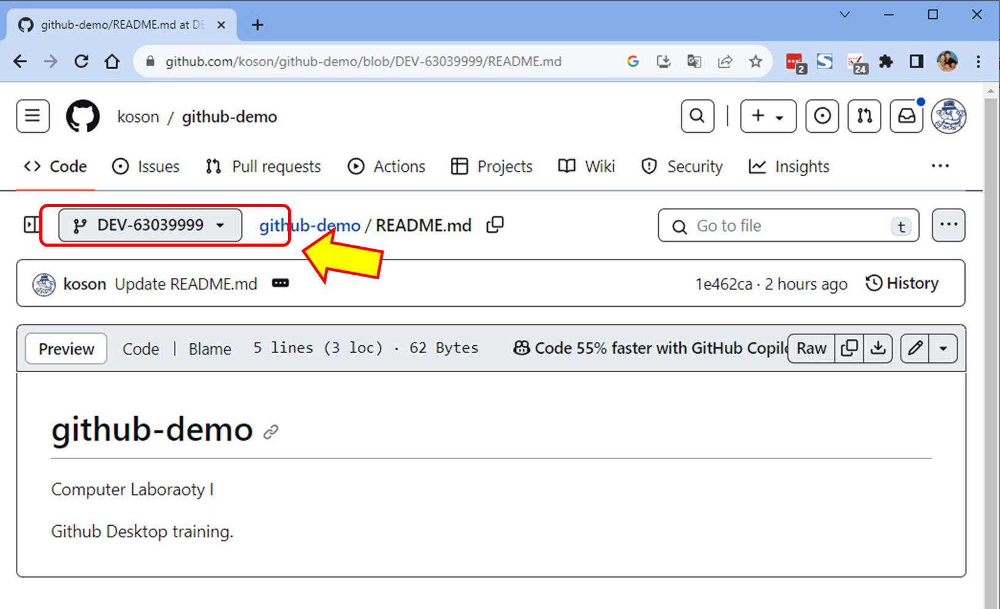
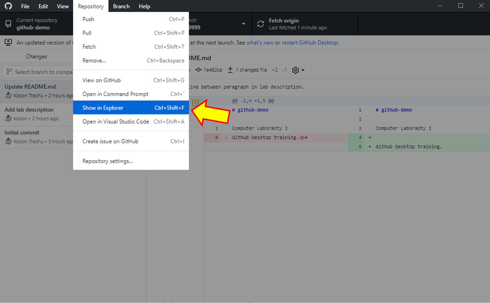

# การทดลอง

## 2. การใช้งานโปรแกรม github desktop ทำงานพื้นฐาน

### 2.2 การสร้าง branch ด้วย github desktop

#### 1 การสร้าง branch ด้วย github desktop

1 ) ในการสร้าง branch (หรือเปลี่ยน branch ในกรณีที่มีอยู่แล้ว) เราสามารถคลิกที่ปุ่ม Current branch ดังรูป

2 ) เมื่อคลิกแล้ว จะมี drop down ขนาดใหญ่ เพื่อให้เราเลือกทำอย่างใดอย่างหนึ่ง ซึ่งในกรณีนี้เราจะสร้าง branch ใหม่

จากรูป เราสามารถเลือกวิธีสร้างได้ 2 รูปแบบ

(a)  โดยการใส่ชื่อ branch ที่ต้องการลงในช่อง text box

(b) โดยการกดปุ่ม New Branch

ทั้งสองกรณีให้ผลที่แตกต่างกัน กรณี (a) นั้นเราจะได้เห็นว่าใน repository ปัจจุบัน มี branch ตรงตามชื่อที่เราจะสร้างใหม่อยู่แล้วหรือไม่ ซึ่งในกรณี (b) จะไม่มีการแสดงชื่อ branch เดิมที่มีอยู่

3 ) ให้ใส่ชื่อ branch ลงในช่อง (a)

กำหนดให้ชื่อ branch มีรูปแบบเป็น `DEV-<Student ID>` ดังตัวอย่างในรูป

4 ) ยืนยันโดยการกด Create branch

#### 2 Publish brach ขึ้นไปยัง github server

คลิกที่ publish branch

#### 3 ตรวจสอบ และย้าย branch บน github server

Refresh browser  หนึ่งครั้ง

(1) คลิกที่ชื่อ Branch ซึ่งปัจจุบันแสดงเป็น main

(2) คลิกที่ชื่อ Branch

ขั้นตอนต่าง ๆ ในการทำงานกับ branch บน github.com ก็จะเหมือนกับที่เคยทำการทดลองไปแล้วในครั้งก่อน ๆ

#### 4 เพิ่มเนื้อหาใน Branch ที่สร้างขึ้นบน Working directory

1 )  กลับไปที่ github desktop  คลิกที่เมนู Repository -> Show in Explorer

2 )  github desktop  จะเปิด file explorer ขึ้นมา ให้สร้าง folder ย่อยตามรหัสนักศึกษา เสร็จแล้วจะมีหน้าตาคล้ายดังตัวอย่าง 

3 ) เข้าไปในโฟลเดอร์ที่สร้างขึ้นใหม่ ให้สร้างไฟล์ html ที่มีเนื้อหาเป็น resume สำหรับสมัครงาน โดยอาจจะแสดงข้อมูลสำคัญต่อไปนี้
- ประวัติการศึกษา
- ประสบการณ์ในการฝึกงานหรือได้รับประกาศนียบัตร
- ตำแหน่งงานที่ต้องการจะทำ
- ความสามามรถด้าน software
- ถ้ามีไฟล์ภาพ เสียง หรือเนื้อหาอื่นใดนอกจากข้อความ ให้ตรวจสอบว่าสามารถใช้งานได้
- สามารถใช้ style sheet หรือ script ได้ และควรแยกเป็นไฟล์ต่างหาก

#### 5 ตรวจสอบไฟล์ที่เปลี่ยนแปลง commit เข้าไปยัง local repository

## [>> การใช้งาน github desktop>>](W12-Labsheet-01.md)
